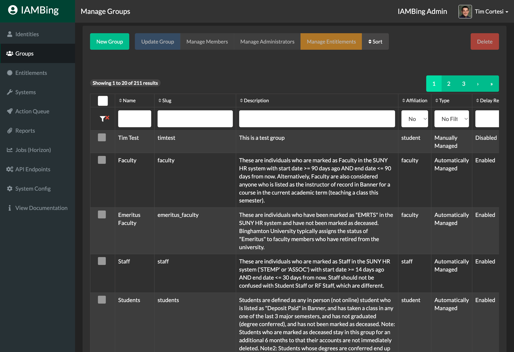

# Overview
IAMBing is a dynamic and highly configurable Identity & Access Management (IAM) engine.  While it was specifically built to meet Binghamton University's IAM needs, its extesible "API First" design should allow it to be utilized and deployed in any number of different environments both inside and outside higher education.

For more information about deploying IAMBing at your own institution or business, please contact Tim Cortesi: [tcortesi@binghamton.edu](mailto:tcortesi@binghamton.edu)

# Developer Installation Instructions

1. Clone the repo locally: `git clone https://github.com/BinghamtonUniversity/IAMBing.git`
2. Install Composer Dependencies: `composer install`
3. Copy the `.env.enample` file to `.env`
4. Setup MySQL Databases:
```bash
$ mysql
> CREATE DATABASE iambing;
> CREATE USER 'iambing'@'127.0.0.1' IDENTIFIED BY 'iambing';
> GRANT ALL PRIVILEGES ON iambing. * TO 'iambing'@'127.0.0.1';
> exit;
```
4. Modify the `.env` file as follows:
```
DB_DATABASE=iambing
DB_USERNAME=iambing
DB_PASSWORD=iambing
```
5. Generate App Key: `php artisan key:generate`
6. Run Migrations & Seed Database: `php artisan migrate:refresh --seed`
7. Serve the application `php artisan serve`

# License
IAMBing is open-source software licensed under the [MIT license](http://opensource.org/licenses/MIT).

# Screenshots 
## Identity Management Interface (Dark Mode)


## Group Management Interface (Dark Mode)

